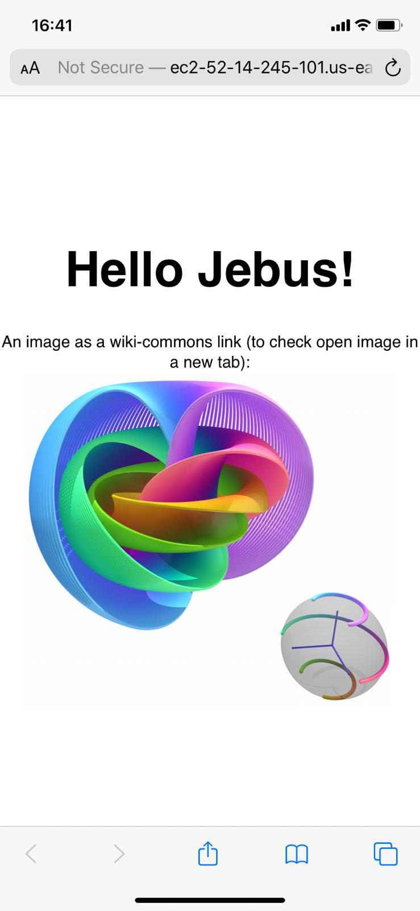
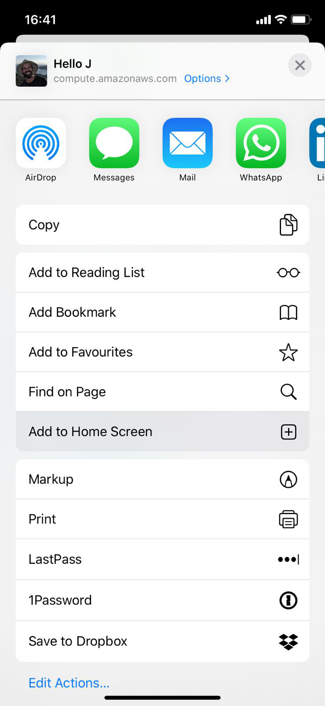
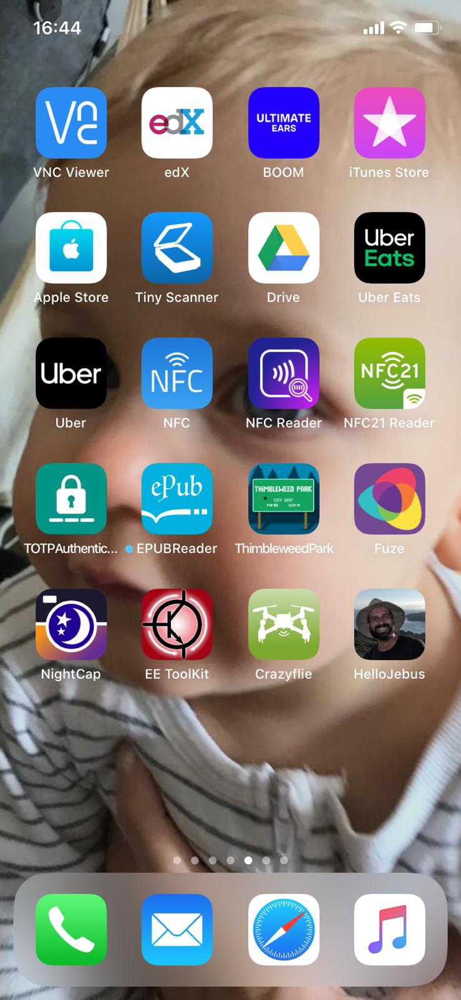

# ProgressivWebApp

Setup webserver on AWS and upload source files and login via ssh
```
chmod 700 keyFile.pem
scp -i keyFile.pem myPWA.zip ubuntu@awsDNS.com:
ssh -i keyFile.pem ubuntu@awsDNS.com
```

Install relevant packages
```
sudo apt update
sudo apt upgrade
sudo apt install tftp tftpd syslinux apache2 unzip
```

Unpack source
```
unzip myPWA.zip
```

Create mount point and copy source
```
sudo mkdir /var/www/html/efs-mount-point
(optional) sudo mount -t efs fs-12345678:/ /var/www/html/efs-mount-point
cd /var/www/html/efs-mount-point 
sudo mkdir sampledir
sudo chown ubuntu sampledir
sudo chmod -R o+r sampledir
sudo mv ~/myPWA sampledir/
```

Start webServer
```
sudo systemctl restart apache2
```
Under security groups open HTTP port for inbound traffic

Open index.html on your phone
```
http://awsDNS.com/efs-mount-point/sampledir/myPWA/index.html
```

and add to home screen 
<p align="center">



</p>

Resize icon and create favicon.ico
```
sudo apt install imagemagick
convert iconJebus.jpeg -resize 128x128  iconJebus-128.png
convert iconJebus-128.png iconJebus-144.png iconJebus-152.png iconJebus-192.png iconJebus-256.png iconJebus-512.png favicon.ico
```
